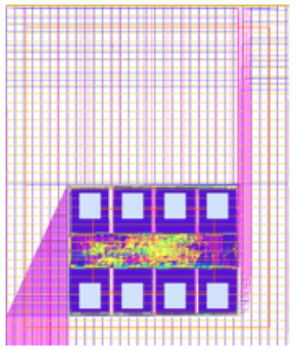
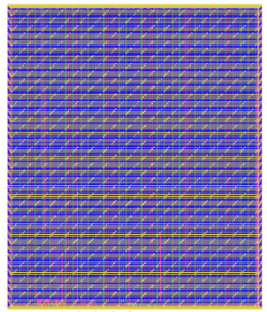
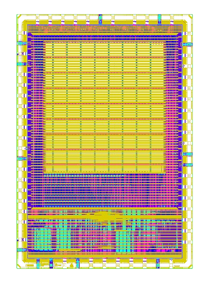

.. raw:: html

   <!---
   # SPDX-FileCopyrightText: 2020 Efabless Corporation
   #
   # Licensed under the Apache License, Version 2.0 (the "License");
   # you may not use this file except in compliance with the License.
   # You may obtain a copy of the License at
   #
   #      http://www.apache.org/licenses/LICENSE-2.0
   #
   # Unless required by applicable law or agreed to in writing, software
   # distributed under the License is distributed on an "AS IS" BASIS,
   # WITHOUT WARRANTIES OR CONDITIONS OF ANY KIND, either express or implied.
   # See the License for the specific language governing permissions and
   # limitations under the License.
   #
   # SPDX-License-Identifier: Apache-2.0
   -->

Caravel User Project
====================

|License| |User CI| |Caravel Build|

Table of contents
=================

-  `Overview <#overview>`__
-  `Quickstart <#quickstart>`__
-  `Caravel Integration <#caravel-integration>`__

   -  `Repo Integration <#repo-integration>`__
   -  `Verilog Integration <#verilog-integration>`__
   -  `GPIO Configuration <#gpio-configuration>`__
   -  `Layout Integration <#layout-integration>`__

-  `Running Full Chip Simulation <#running-full-chip-simulation>`__
-  `User Project Wrapper Requirements <#user-project-wrapper-requirements>`__
-  `Hardening the User Project using
   Openlane <#hardening-the-user-project-using-openlane>`__
-  `Running Timing Analysis on Existing Projects <#running-timing-analysis-on-existing-projects>`__
-  `Checklist for Open-MPW
   Submission <#checklist-for-open-mpw-submission>`__

Overview
========

This repo contains a sample user project that utilizes the
`caravel <https://github.com/efabless/caravel.git>`__ chip user space.
The user project is a simple counter that showcases how to make use of
`caravel's <https://github.com/efabless/caravel.git>`__ user space
utilities like IO pads, logic analyzer probes, and wishbone port. The
repo also demonstrates the recommended structure for the open-mpw
shuttle projects.

Prerequisites
=============

- Docker: `Linux <https://hub.docker.com/search?q=&type=edition&offering=community&operating_system=linux&utm_source=docker&utm_medium=webreferral&utm_campaign=dd-smartbutton&utm_location=header>`_ ||  `Windows <https://desktop.docker.com/win/main/amd64/Docker%20Desktop%20Installer.exe?utm_source=docker&utm_medium=webreferral&utm_campaign=dd-smartbutton&utm_location=header>`_ || `Mac with Intel Chip <https://desktop.docker.com/mac/main/amd64/Docker.dmg?utm_source=docker&utm_medium=webreferral&utm_campaign=dd-smartbutton&utm_location=header>`_ || `Mac with M1 Chip <https://desktop.docker.com/mac/main/arm64/Docker.dmg?utm_source=docker&utm_medium=webreferral&utm_campaign=dd-smartbutton&utm_location=header>`_

- Python 3.6+ with PIP

Quickstart 
===========

---------------------
Starting your project
---------------------

#. To start the project you first need to create a new repository based on the `caravel_user_project <https://github.com/efabless/caravel_user_project/>`_ template and make sure your repo is public and includes a README.

   *   Follow https://github.com/efabless/caravel_user_project/generate to create a new repository.
   *   Clone the reposity using the following command:
   
       .. code:: bash
        
    	git clone <your github repo URL>
	
#.  To setup your local environment run:

    .. code:: bash
    
    	cd <project_name> # project_name is the name of your repo
	
    	mkdir dependencies
	
	export OPENLANE_ROOT=$(pwd)/dependencies/openlane_src # you need to export this whenever you start a new shell
	
	export PDK_ROOT=$(pwd)/dependencies/pdks # you need to export this whenever you start a new shell

	# export the PDK variant depending on your shuttle, if you don't know leave it to the default
	
	# for sky130 MPW shuttles....
	export PDK=sky130A
	
	# for the gf180 GFMPW shuttles...
	export PDK=gf180mcuC

        make setup

*   This command will setup your environment by installing the following
    
    - caravel_lite (a lite version of caravel)
    - management core for simulation
    - openlane to harden your design 
    - pdk

	
#.  Now you can start hardening your design

    *   To start hardening you project you need 
        - RTL verilog model for your design for OpenLane to harden
        - A subdirectory for each macro in your project under ``openlane/`` directory, each subdirectory should include openlane configuration files for the macro

        .. code:: bash

           make <module_name>	
        ..

		For an example of hardening a project please refer to `Hardening the User Project using OpenLane`_. .
	
#.  Integrate modules into the user_project_wrapper

    *   Change the environment variables ``VERILOG_FILES_BLACKBOX``, ``EXTRA_LEFS`` and ``EXTRA_GDS_FILES`` in ``openlane/user_project_wrapper/config.tcl`` to point to your module
    *   Instantiate your module(s) in ``verilog/rtl/user_project_wrapper.v``
    *   Harden the user_project_wrapper including your module(s), using this command:

        .. code:: bash

            make user_project_wrapper

#.  Run simulation on your design

    *   You need to include your rtl/gl/gl+sdf files in ``verilog/includes/includes.<rtl/gl/gl+sdf>.caravel_user_project``

        **NOTE:** You shouldn't include the files inside the verilog code

        .. code:: bash

            # you can then run RTL simulations using
            make verify-<testbench-name>-rtl

            # OR GL simulation using
            make verify-<testbench-name>-gl

            # OR for GL+SDF simulation using 
            # sdf annotated simulation is slow
            make verify-<testbench-name>-gl-sdf

            # for example
            make verify-io_ports-rtl

#.  Run opensta on your design

    *   Extract spefs for ``user_project_wrapper`` and macros inside it:

        .. code:: bash

            make extract-parasitics

    *   Create spef mapping file that maps instance names to spef files:

        .. code:: bash

            make create-spef-mapping

    *   Run opensta:

        .. code:: bash

            make caravel-sta

        **NOTE:** To update timing scripts run ``make setup-timing-scripts``

#.  Run standalone LVS

    .. code:: bash

        DESIGN=<macro> make lvs # macro is the macro you want to run LVS on
	
#.  Run the precheck locally 

    .. code:: bash

        make precheck
        make run-precheck

#. You are done! now go to https://efabless.com/open_shuttle_program/ to submit your project!

Caravel Integration
===================

----------------
Repo Integration
----------------

Caravel files are kept separate from the user project by having caravel
as submodule. The submodule commit should point to the latest of
caravel/caravel-lite master/main branch. The following files should have a symbolic
link to `caravel's <https://github.com/efabless/caravel.git>`__
corresponding files:

-  `Openlane Makefile <../../openlane/Makefile>`__: This provides an easier
   way for running openlane to harden your macros. Refer to `Hardening
   the User Project Macro using
   Openlane <#hardening-the-user-project-using-openlane>`__. Also,
   the makefile retains the openlane summary reports under the signoff
   directory.

-  `Pin order <../../openlane/user_project_wrapper/pin_order.cfg>`__ file for
   the user wrapper: The hardened user project wrapper macro must have
   the same pin order specified in caravel's repo. Failing to adhere to
   the same order will fail the gds integration of the macro with
   caravel's back-end.

The symbolic links are automatically set when you run ``make install``.

-------------------
Verilog Integration
-------------------

You need to create a wrapper around your macro that adheres to the
template at
`user\_project\_wrapper <https://github.com/efabless/caravel/blob/master/verilog/rtl/__user_project_wrapper.v>`__.
The wrapper top module must be named ``user_project_wrapper`` and must
have the same input and output ports as the golden wrapper `template <https://github.com/efabless/caravel/blob/master/verilog/rtl/__user_project_wrapper.v>`__. The wrapper gives access to the
user space utilities provided by caravel like IO ports, logic analyzer
probes, and wishbone bus connection to the management SoC.

For this sample project, the user macro makes use of:

-  The IO ports for displaying the count register values on the IO pads.

-  The LA probes for supplying an optional reset and clock signals and
   for setting an initial value for the count register.

-  The wishbone port for reading/writing the count value through the
   management SoC.

Refer to `user\_project\_wrapper <../../verilog/rtl/user_project_wrapper.v>`__
for more information.

.. raw:: html

   

   
   

.. raw:: html

   

-------------------
GPIO Configuration
-------------------

You are required to specify the power-on default configuration for each GPIO in Caravel.  The default configuration provide the state the GPIO will come up on power up.  The configuration can be changed by the management SoC during firmware execution.

Configuration settings define whether the GPIO is configured to connect to the user project area or the managment SoC.  They also determine whether IOs are inputs or outputs, digital or analog, as well as whether pull-up or pull-down resistors are configured for inputs.

GPIOs are configured by assigning predefined values for each IO in the file `verilog/rtl/user_defines.v <https://github.com/efabless/caravel_user_project/blob/main/verilog/rtl/user_defines.v>`_ in your project.

You need to assigned configuration values for GPIO[5] thru GPIO[37]. 

GPIO[0] thru GPIO[4] are preset and cannot be changed.

The following values are redefined for assigning to GPIOs.

- GPIO_MODE_MGMT_STD_INPUT_NOPULL
- GPIO_MODE_MGMT_STD_INPUT_PULLDOWN
- GPIO_MODE_MGMT_STD_INPUT_PULLUP
- GPIO_MODE_MGMT_STD_OUTPUT
- GPIO_MODE_MGMT_STD_BIDIRECTIONAL
- GPIO_MODE_MGMT_STD_ANALOG

- GPIO_MODE_USER_STD_INPUT_NOPULL
- GPIO_MODE_USER_STD_INPUT_PULLDOWN
- GPIO_MODE_USER_STD_INPUT_PULLUP
- GPIO_MODE_USER_STD_OUTPUT
- GPIO_MODE_USER_STD_BIDIRECTIONAL
- GPIO_MODE_USER_STD_OUT_MONITORED 
- GPIO_MODE_USER_STD_ANALOG

MPW_Prececk includes a check to confirm each GPIO is assigned a valid value.

-------------------
Layout Integration
-------------------

The caravel layout is pre-designed with an empty golden wrapper in the user space. You only need to provide us with a valid ``user_project_wrapper`` GDS file. And, as part of the tapeout process, your hardened ``user_project_wrapper`` will be inserted into a vanilla caravel layout to get the final layout shipped for fabrication. 

.. raw:: html

   

   
   

   
To make sure that this integration process goes smoothly without having any DRC or LVS issues, your hardened ``user_project_wrapper`` must adhere to a number of requirements listed at `User Project Wrapper Requirements <#user-project-wrapper-requirements>`__ .

Running Full Chip Simulation
============================

First, you will need to install the simulation environment, by

.. code:: bash

    make simenv

This will pull a docker image with the needed tools installed.

Then, run the RTL simulation by

.. code:: bash

    export PDK_ROOT=<pdk-installation-path>
    make verify-<testbench-name>-rtl
    
    # For example
    make verify-io_ports-rtl

Once you have the physical implementation done and you have the gate-level netlists ready, it is crucial to run full gate-level simulations to make sure that your design works as intended after running the physical implementation. 

Run the gate-level simulation by: 

.. code:: bash

    export PDK_ROOT=<pdk-installation-path>
    make verify-<testbench-name>-gl

    # For example
    make verify-io_ports-gl

To make sure that your design is timing clean, one way is running sdf annotated gate-level simulation
Run the sdf annotated gate-level simulation by: 

.. code:: bash

    export PDK_ROOT=<pdk-installation-path>
    make verify-<testbench-name>-gl-sdf

    # For example
    make verify-io_ports-gl-sdf

This sample project comes with four example testbenches to test the IO port connection, wishbone interface, and logic analyzer. The test-benches are under the
`verilog/dv <https://github.com/efabless/caravel_user_project/tree/main/verilog/dv>`__ directory. For more information on setting up the
simulation environment and the available testbenches for this sample
project, refer to `README <https://github.com/efabless/caravel_user_project/blob/main/verilog/dv/README.md>`__.

User Project Wrapper Requirements
=================================

Your hardened ``user_project_wrapper`` must match the `golden user_project_wrapper <https://github.com/efabless/caravel/blob/master/gds/user_project_wrapper_empty.gds.gz>`__ in the following: 

- Area ``(2.920um x 3.520um)``
- Top module name ``"user_project_wrapper"``
- Pin Placement
- Pin Sizes 
- Core Rings Width and Offset
- PDN Vertical and Horizontal Straps Width 

.. raw:: html

   

   
   

 
You are allowed to change the following if you need to: 

- PDN Vertical and Horizontal Pitch & Offset

.. raw:: html

   

   
   

 
To make sure that you adhere to these requirements, we run an exclusive-or (XOR) check between your hardened ``user_project_wrapper`` GDS and the golden wrapper GDS after processing both layouts to include only the boundary (pins and core rings). This check is done as part of the `mpw-precheck <https://github.com/efabless/mpw_precheck>`__ tool. 

Hardening the User Project using OpenLane
==========================================

---------------------
OpenLane Installation 
---------------------

You will need to install openlane by running the following

.. code:: bash

   export OPENLANE_ROOT=<openlane-installation-path>

   # you can optionally specify the openlane tag to use
   # by running: export OPENLANE_TAG=<openlane-tag>
   # if you do not set the tag, it defaults to the last verfied tag tested for this project

   make openlane

For detailed instructions on the openlane and the pdk installation refer
to
`README <https://github.com/The-OpenROAD-Project/OpenLane#setting-up-openlane>`__.

-----------------
Hardening Options 
-----------------

There are three options for hardening the user project macro using
openlane:

+--------------------------------------------------------------+--------------------------------------------+--------------------------------------------+
|           Option 1                                           |            Option 2                        |           Option 3                         |
+--------------------------------------------------------------+--------------------------------------------+--------------------------------------------+
| Hardening the user macro(s) first, then inserting it in the  |  Flattening the user macro(s) with the     | Placing multiple macros in the wrapper     |
| user project wrapper with no standard cells on the top level |  user_project_wrapper                      | along with standard cells on the top level |
+==============================================================+============================================+============================================+
| |pic1|                                                       | |pic2|                                     | |pic3|                                     |
|                                                              |                                            |                                            |
+--------------------------------------------------------------+--------------------------------------------+--------------------------------------------+
|           ex: |link1|                                        |                                            |           ex: |link2|                      |
+--------------------------------------------------------------+--------------------------------------------+--------------------------------------------+

.. |link1| replace:: `caravel_user_project <https://github.com/efabless/caravel_user_project>`__

.. |link2| replace:: `caravel_ibex <https://github.com/efabless/caravel_ibex>`__

For more details on hardening macros using openlane, refer to `README <https://github.com/The-OpenROAD-Project/OpenLane/blob/master/docs/source/hardening_macros.md>`__.

-----------------
Running OpenLane 
-----------------

For this sample project, we went for the first option where the user
macro is hardened first, then it is inserted in the user project
wrapper without having any standard cells on the top level.

.. raw:: html

   

   
   

.. raw:: html

   

   
To reproduce hardening this project, run the following:

.. code:: bash

   # DO NOT cd into openlane
   
   # Run openlane to harden user_proj_example
   make user_proj_example
   # Run openlane to harden user_project_wrapper
   make user_project_wrapper

For more information on the openlane flow, check `README <https://github.com/The-OpenROAD-Project/OpenLane#readme>`__.

Running MPW Precheck Locally
=================================

You can install the `mpw-precheck <https://github.com/efabless/mpw_precheck>`__ by running 

.. code:: bash

   # By default, this install the precheck in your home directory
   # To change the installtion path, run "export PRECHECK_ROOT=<precheck installation path>" 
   make precheck

This will clone the precheck repo and pull the latest precheck docker image. 

Then, you can run the precheck by running

.. code:: bash

   make run-precheck

This will run all the precheck checks on your project and will produce the logs under the ``checks`` directory.

Running Timing Analysis on Existing Projects
========================================================

Start by updating the Makefile for your project.  Starting in the project root...

.. code:: bash
  
   curl -k https://raw.githubusercontent.com/efabless/caravel_user_project/main/Makefile > Makefile
   
   make setup-timing-scripts
   
   make install
   
   make install_mcw
   

This will update Caravel design files and install the scripts for running timing. 

Then, you can run then run timing by the following...

.. code:: bash

   make extract-parasitics
   
   make create-spef-mapping
   
   make caravel-sta
   

A summary of timing results is provided at the end of the flow. 

Other Miscellaneous Targets
============================

The makefile provides a number of useful that targets that can run LVS, DRC, and XOR checks on your hardened design outside of openlane's flow. 

Run ``make help`` to display available targets. 

Run lvs on the mag view, 

.. code:: bash

   make lvs-<macro_name>

Run lvs on the gds, 

.. code:: bash

   make lvs-gds-<macro_name>

Run lvs on the maglef, 

.. code:: bash

   make lvs-maglef-<macro_name>

Run drc using magic,

.. code:: bash

   make drc-<macro_name>

Run antenna check using magic, 

.. code:: bash

   make antenna-<macro_name>

Run XOR check, 

.. code:: bash

   make xor-wrapper
   
   

Checklist for Open-MPW Submission
=================================

-  ✔️ The project repo adheres to the same directory structure in this
   repo.
-  ✔️ The project repo contain info.yaml at the project root.
-  ✔️ Top level macro is named ``user_project_wrapper``.
-  ✔️ Full Chip Simulation passes for RTL and GL (gate-level)
-  ✔️ The hardened Macros are LVS and DRC clean
-  ✔️ The project contains a gate-level netlist for ``user_project_wrapper`` at verilog/gl/user_project_wrapper.v
-  ✔️ The hardened ``user_project_wrapper`` adheres to the same pin
   order specified at
   `pin\_order <https://github.com/efabless/caravel/blob/master/openlane/user_project_wrapper_empty/pin_order.cfg>`__
-  ✔️ The hardened ``user_project_wrapper`` adheres to the fixed wrapper configuration specified at `fixed_wrapper_cfgs <https://github.com/efabless/caravel/blob/master/openlane/user_project_wrapper_empty/fixed_wrapper_cfgs.tcl>`__
-  ✔️ XOR check passes with zero total difference.
-  ✔️ Openlane summary reports are retained under ./signoff/
-  ✔️ The design passes the `mpw-precheck <https://github.com/efabless/mpw_precheck>`__ 

.. |License| image:: https://img.shields.io/badge/License-Apache%202.0-blue.svg
   :target: https://opensource.org/licenses/Apache-2.0
.. |User CI| image:: https://github.com/efabless/caravel_project_example/actions/workflows/user_project_ci.yml/badge.svg
   :target: https://github.com/efabless/caravel_project_example/actions/workflows/user_project_ci.yml
.. |Caravel Build| image:: https://github.com/efabless/caravel_project_example/actions/workflows/caravel_build.yml/badge.svg
   :target: https://github.com/efabless/caravel_project_example/actions/workflows/caravel_build.yml
